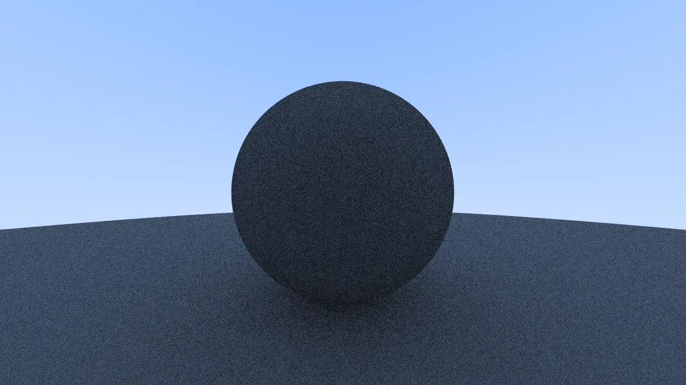

# clj-raytracer

<p align="center">
  
</p>

A pure Clojure implementation of the famous ["Ray Tracing in One Weekend"](https://raytracing.github.io/books/RayTracingInOneWeekend.html) book. 

This project explores functional programming patterns applied to computer graphics, using [Quil](https://quil.info/) (a Clojure wrapper for Processing) for real-time rendering and visualization.

## Features

- **Functional Vector Math:** High-performance 3D vector operations using Clojure's destructuring.
- **Real-time Preview:** Integrated with Quil to visualize the rendering process directly in a window.
- **Pure Clojure:** Built with the latest Clojure 1.12 features and `tools.build`.

## Prerequisites

You need the [Clojure CLI tool](https://clojure.org/guides/install_clojure) installed on your machine.

## How to Run

To start the raytracer and see the output window:

```bash
clj -M:run

```

## Building

To package the project into a standalone executable JAR:

```bash
clj -T:build uber

```

The resulting file will be located at `target/raytracer-0.1.0-SNAPSHOT-standalone.jar`.

## Project Structure

* `src/com/adaiasmagdiel/raytracer/vec3.clj`: Core vector math library.
* `src/com/adaiasmagdiel/raytracer.clj`: Main entry point and Quil sketch configuration.
* `build.clj`: Build script for generating artifacts.

## License

Copyright © 2026 Adaías Magdiel

Distributed under the MIT License. See [LICENSE](LICENSE) file for details.
